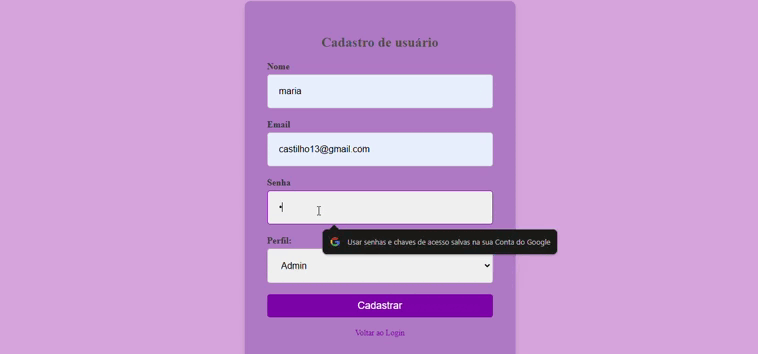

# cadastro ou login de usuarios👩‍💻

# 📃descrição
   🔸 esse projeto tem a função de gerenciar o acesso de usuários em uma aplicação, permitindo que eles façam login com um email e senha, ou se cadastrem fornecendo informações pessoais como nome, email, senha e perfil. Isso facilita o controle de acesso e a personalização da experiência do usuário com base em diferentes perfis, como admin, gestor ou colaborador.  
   Quando se tem um perfil cadastrado como admin ele pode excluir ou editar alguma informação dos outros usuarios, ja o perfil de gestor pode somente editar as informações dos usuarios e o perfil de colaborador somente vizualiza a paginá
   esse projeto tambem conta com um banco de dados então todas as informações de cadastro vai para um banco de dados.
    
## funçoes

 
# 💻tecnologias utilizadas
    🟢PHP
    🟢CSS
    🟢Mysql (banco de dados)  

# 🖌️autores  
🔹janaina🖤  (https://github.com/janapaulinoo)  
🔹Maria Fernanda 🤍  (https://github.com/MaferCastilho)